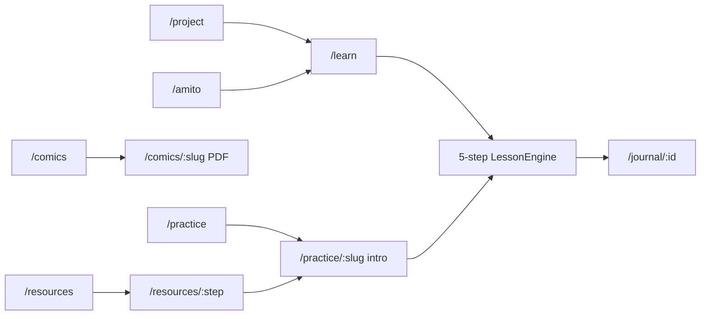

# STOP&SCAN Website Sitemap

> Generated from the current codebase. The landing page (`/`) is listed for navigation context only; details below cover all other routes.

## Route overview

```
/                           Home (landing — not detailed here)
├── /learn                  Learn STOP&SCAN (guided lesson)
├── /practice               Case Files library
│   └── /practice/:slug     Individual case file
├── /resources              Resource hub
│   └── /resources/:step    Framework step deep-dive
├── /comics                 Comics catalog
│   └── /comics/:slug       Comic PDF reader
├── /journal                Reflection journal (list)
│   └── /journal/:id        Single reflection entry
├── /project                About the project
├── /amito                  Meet Amito
├── /404                    Not found
└── *                       Redirects to /404
```

## Global chrome (all pages)

Every page shares a sticky header and footer via `Layout`.

| Element | Links / actions |
|---------|-------------------|
| **Header nav** | Learn · Practice · Resources · Comics · Project · Meet Amito · **My Journal** (accent CTA) |
| **Logo** | Returns to `/` |
| **Mobile** | Hamburger menu with the same links |
| **Footer — Explore** | Learn, Practice, Resources, Comics, My Journal |
| **Footer — About** | The project, Meet Amito |

---

## `/learn` — Learn STOP&SCAN

**Purpose:** Introduce the framework through a single guided walkthrough with full scaffolding and immediate feedback.

### Intro screen (before lesson starts)

- Amito greeting pose
- Title: **Learn STOP&SCAN**
- Explains the flow: gut reaction → scan evidence → reflect on what changed; no wrong answers
- Five step cards: **Stop**, **Source**, **Content**, **Alignment**, **Now Reflect**
- Today's example: *The Celebrity Investment Video* (~8 min)
- **Start the guided lesson →** — enters the lesson engine
- **Read the framework first** — links to `/resources`

### Guided lesson (LessonEngine, `mode="learn"`)

Five sequential screens matching the STOP&SCAN steps. Progress bar at top.

| Step | Screen content | User interactions |
|------|----------------|-------------------|
| **1 · Stop** | Social post mockup; Amito prompt | Select gut reaction; select feeling chip; optional free-text note ("Before checking, I felt…") |
| **2 · Source** | Source findings (details visible); comments with signals revealed; multiple-choice question | Pick one or more source signals (includes "I need more evidence before deciding"); **Check my answer** reveals Amito feedback; **Continue** |
| **3 · Content** | Post mockup with highlights; multiple-choice question | Pick content/pressure signals; check answer for feedback; continue |
| **4 · Alignment** | Simulated search results with signals visible; multiple-choice question | Pick alignment signals; check answer for feedback; continue |
| **5 · Now Reflect** | Before/after summary; evidence textarea; next-action choices; reward message | Enter "After checking, I think…"; note what changed your mind; select one or more next actions (recommended options labeled); **Save to my Journal** |

**Navigation within lesson:** Back · Check my answer (learn) / Show hint (practice) · Continue · Save to my Journal (final step). Progress auto-saves to `localStorage` via the journal context.

---

## `/practice` — Case Files

**Purpose:** Browse and launch independent practice scenarios with less hand-holding than the guided lesson.

### Page content

- Title: **Case Files**
- Intro: fewer cues than the lesson; hints available; reflections can be saved and exported
- **Case cards** (clickable):

| Case | Kind | Difficulty | Est. time |
|------|------|------------|-----------|
| The Celebrity Investment Video | Financial scam | intro | 8 min |
| The Deepfake Money Expert Ad | Financial scam | core | 9 min |
| The AI Fact-Check That Was Wrong | Authentic content | advanced | 10 min |

- **More coming soon** placeholder card (authentic-content and decontextualized-footage cases planned)

### User interactions

- Click a case card → `/practice/:slug`
- Hover lift animation on cards

---

## `/practice/:slug` — Individual case file

**Purpose:** Case-specific intro, then the same five-step engine in practice mode.

### Intro screen

- Kind · difficulty · duration badges
- Case title and summary
- Amito "stop" pose
- Note: practice mode gives fewer cues; **Show hint** adds extra feedback at the end
- **Begin this case →** — starts LessonEngine (`mode="practice"`)
- **Back to library** → `/practice`

### Invalid slug

- "Case file not found" with link back to `/practice`

### Practice lesson differences (vs. learn)

| Behavior | Practice mode |
|----------|---------------|
| Source/content/alignment details | Hidden until user clicks **Show hint** |
| Feedback timing | Delayed until reflect step (practice review panel compares selections vs. flagged signals) |
| Hint usage | Tracked and shown on saved journal entries |
| Button label | "Show hint" instead of "Check my answer" |

Same five-screen flow and **Save to my Journal** on completion.

---

## `/resources` — Resource hub

**Purpose:** Read the reasoning behind each STOP&SCAN step (framework theory, not case-specific).

### Page content

- Title: **Resource hub**
- Intro: interrogate context, provenance, and alignment — not visual artifact checklists
- Five cards (one per framework step), each linking to `/resources/:step`:

| Step | Card question (preview) |
|------|-------------------------|
| Stop | Pause and register your gut reaction. |
| Source | Who is really behind this? |
| Content | Does what you see actually hold up? |
| Alignment | Does everything fit together? |
| Now Reflect | Has your judgment changed — and why? |

Each card shows the step letter/color, title, guiding question, intro blurb, and **Read more →**.

### User interactions

- Click any step card → `/resources/:step`

---

## `/resources/:step` — Framework step deep-dive

**Valid steps:** `stop` · `source` · `content` · `alignment` · `reflect`

### Page structure

1. **← All steps** back link
2. Step badge (letter + color), title, guiding question
3. Intro paragraph
4. **Ask yourself** — bulleted reflection prompts
5. Amito pose + **Why it works** card with takeaway highlight
6. **Prev / Next step** navigation (or **Try it on a case →** on the last step → celebrity investment scam)

### Invalid step

- "Step not found" with link to `/resources`

### User interactions

- Read-only content page
- Sequential navigation between steps
- Final step CTA launches a practice case

---

## `/comics` — Comics

**Purpose:** Supplementary visual literacy — sequential art as a way to slow down and question believability.

### Page content

- Title: **Comics**
- Intro on comics as a literacy tool; collaboration with Julian Lawrence (external link)
- **Comic cards:**

| Title | Summary |
|-------|---------|
| STOP & SCAN! Real or AI? | Charleen and a flood of sensational posts — visual intro to pausing before you trust what scrolls past |

- Empty-state message if catalog is empty

### User interactions

- Click comic card → `/comics/:slug`
- External link to julianlawrence.net (new tab)

---

## `/comics/:slug` — Comic reader

**Purpose:** Read a comic strip PDF in-browser.

### Page content

- **← Back to comics**
- Comic title and summary
- Embedded **PdfReader** component

### PdfReader interactions

| Control | Action |
|---------|--------|
| Prev / Next | Turn pages (keyboard: ← →, Page Up/Down, Home, End) |
| Zoom − / + | Adjust scale |
| Fit width | Reset to width-fit |
| Spread | Two-page spread (desktop, ≥640px) |
| Full screen | Toggle fullscreen |
| Download | Download PDF |
| Swipe | Left/right page turn on mobile |

Invalid slug redirects to `/comics`.

---

## `/journal` — My Journal

**Purpose:** View locally saved reflections from completed or in-progress lessons and cases.

### List view (`/journal`)

- Title: **My Journal**
- Explains entries live on this device; capture gut reaction → final decision arc

**Empty state:**

- Amito reflect pose
- Links: **Start the lesson** (`/learn`) · **Browse case files** (`/practice`)

**With entries:** Grid of reflection cards showing:

- Date · complete / in-progress status
- Case title · mode (Guided lesson / Practice case)
- Felt → decision summary
- **Open →** · **Delete**

### Entry view (`/journal/:id`)

Structured reflection document:

| Section | Contents |
|---------|----------|
| What I felt first | First reaction, feeling, stop note |
| What I noticed | Source, pressure, and alignment signal choices |
| What changed my mind | Final thought, evidence that shifted judgment |
| What I'll do next | Selected next actions |
| Footer | Amito reward + habit reminder |

**Actions:** Export Markdown · Print / PDF · ← All reflections

### User interactions

- Open, delete, export, and print entries
- Auto-populated from LessonEngine on save

---

## `/project` — The project

**Purpose:** Explain the research and design rationale behind STOP&SCAN.

### Sections

1. **The project** — scaffolded sensemaking for trust calibration; targets human cognition, not detection tech
2. **Why a framework, not a detector** — deepfake detection limits, overconfidence, label backfire
3. **What makes it different** (four cards):
   - Pre-commitment gut check
   - Reasoning, not artifact detection
   - Uncertainty as a valid outcome
   - Teaching manipulation mechanics
4. **Who it's for** — primary: 16–25 in educational contexts; secondary: adults in high-stakes domains
5. **UN SDG alignment** — SDG 4 (Quality Education) · SDG 16 (Peace, Justice & Strong Institutions)
6. **CTA banner** — **Try the framework →** (`/learn`)

### User interactions

- Read-only; single CTA to start learning

---

## `/amito` — Meet Amito

**Purpose:** Introduce the guide character and map framework steps to visual cues.

### Sections

1. **Hero** — who Amito is (friendly messenger; slows you down without judgment) + large greeting pose
2. **Amito's colors** — table mapping each framework step to its Amito visual cue (glow, cuff, logo)
3. **Amito's poses** — grid of seven poses: Greeting, Stop, Source, Content, Alignment, Reflect, Reward
4. **CTA** — "Amito carries the experience — but STOP&SCAN is the habit." → **Walk through it with Amito →** (`/learn`)

### User interactions

- Read-only character showcase; CTA to guided lesson

---

## `/404` — Not found

**Purpose:** Friendly dead-end for unknown routes (all `*` paths redirect here).

### Content

- Amito alignment pose
- **Hmm — nothing here yet**
- **Back home** → `/`

---

## Cross-page user journeys



| Journey | Typical path |
|---------|--------------|
| First-time learner | Resources (optional) → Learn → Journal |
| Self-directed practice | Practice → Case → Journal |
| Theory then apply | Resources/:step chain → Practice case |
| Supplementary reading | Comics → PDF reader |
| About / motivation | Project or Meet Amito → Learn |

---

## Data & persistence notes

- **Cases:** JSON in `src/data/cases/` — three live cases
- **Resources:** Static copy in `src/data/resources.ts` — one page per framework step
- **Comics:** Catalog in `src/data/comics.ts`; PDFs in `public/comics/`
- **Journal:** Browser `localStorage` only — no server sync
